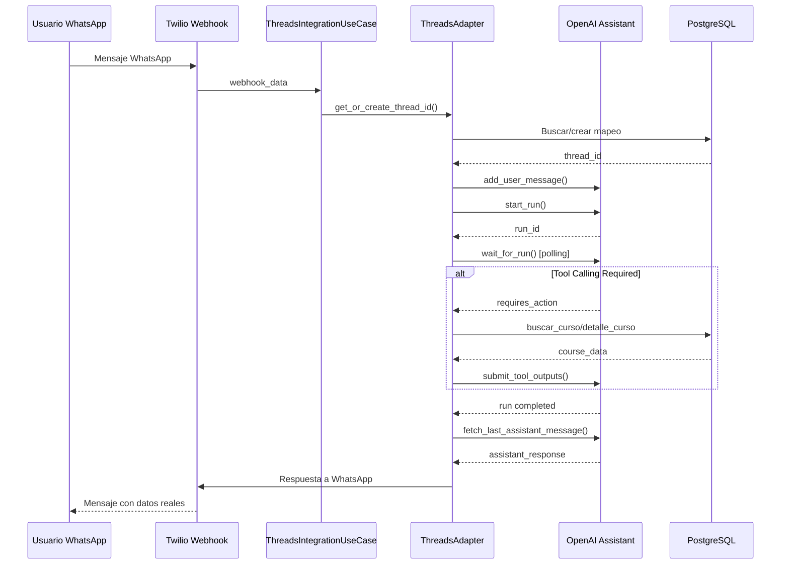

# 🧵 OpenAI Threads Integration - Guía Completa

## 🎯 **ESTADO: INTEGRACIÓN COMPLETADA Y LISTA**

✅ **Base de datos**: Tabla `oa_threads_map` creada  
✅ **Repositorio**: `OAThreadsMapRepository` implementado  
✅ **Adapter**: `ThreadsAdapter` con función calling completo  
✅ **Use Case**: `ThreadsIntegrationUseCase` integrado  
✅ **Webhook**: Integración no invasiva en webhook principal  
✅ **Tool Calling**: Herramientas `buscar_curso` y `detalle_curso`  
✅ **OpenAI Webhook**: Manejo asíncrono de eventos (opcional)  
✅ **Tests**: Script de pruebas completo  

---

## 🚀 **CONFIGURACIÓN RÁPIDA**

### 1. Variables de Entorno
Añade a tu archivo `.env`:
```bash
# === OPENAI ASSISTANTS API ===
ASSISTANT_ID=asst_xxxxxxxxxxxxxxxxxxxxxxxx
OPENAI_WEBHOOK_SECRET=whsec_xxxxxxxxxxxxxxxx  # Opcional
```

### 2. Migración de Base de Datos
```bash
# Ejecutar migración SQL
psql $DATABASE_URL -f scripts/2025_08_oa_threads_map_migration.sql
```

### 3. Configurar Assistant en OpenAI
1. Ve a https://platform.openai.com/assistants
2. Crea Assistant con las herramientas de `docs/OPENAI_ASSISTANT_TOOLS_CONFIG.md`
3. Copia el Assistant ID a `.env`

### 4. Probar Integración
```bash
# Ejecutar tests
python test_threads_integration.py

# Iniciar servidor
python run_webhook_server.py

# Verificar health check
curl http://localhost:8000/
```

---

## 📋 **COMPONENTES IMPLEMENTADOS**

### 🗃️ Base de Datos
- **Tabla**: `oa_threads_map` - Mapeo user_phone ↔ thread_id
- **Repositorio**: `OAThreadsMapRepository` - CRUD completo
- **Índices**: Optimizados para búsqueda rápida

### 🧵 Threads Adapter
- **Ubicación**: `app/infrastructure/openai/threads_adapter.py`
- **Funciones**:
  - `get_or_create_thread_id()` - Gestión de threads por usuario
  - `add_user_message()` - Añadir mensajes del usuario
  - `start_run()` - Iniciar runs del assistant
  - `wait_for_run()` - Polling con tool calling
  - `fetch_last_assistant_message()` - Obtener respuestas

### 🛠️ Function Calling
- **buscar_curso()** - Búsqueda de cursos por nombre/nivel
- **detalle_curso()** - Información completa de curso específico
- **Integración**: Acceso directo a PostgreSQL via `CourseRepository`

### 🎮 Use Case Principal
- **Ubicación**: `app/application/usecases/threads_integration_use_case.py`
- **Funcionalidad**: Flujo completo de conversación con threads
- **Fallbacks**: Respuestas contextuales si OpenAI falla

### 🌐 Integración en Webhook
- **No Invasiva**: Mantiene flujo existente intacto
- **Condicional**: Solo activo si `ASSISTANT_ID` está configurado
- **Fallback**: Automático al flujo tradicional si hay errores

### 📡 Webhook de OpenAI (Opcional)
- **Endpoints**: `/webhooks/openai` y `/webhooks/openai/health`
- **Eventos**: `run.created`, `run.requires_action`, `run.completed`, etc.
- **Verificación**: Firma HMAC-SHA256 si `OPENAI_WEBHOOK_SECRET` está configurado

---

## 🔄 **FLUJO DE FUNCIONAMIENTO**

### Flujo Normal (Con Threads)


### Flujo de Fallback (Sin Threads)
Si `ASSISTANT_ID` no está configurado o hay error, automáticamente usa el flujo tradicional existente.

---

## 🧪 **TESTING**

### Test Automatizado
```bash
python test_threads_integration.py
```

**Tests Incluidos**:
- ✅ Configuración de variables de entorno
- ✅ Conectividad de base de datos
- ✅ Inicialización de ThreadsAdapter
- ✅ Use cases y dependencias
- ✅ Compatibilidad con webhook existente
- ✅ Comportamiento de fallback

### Test Manual
```bash
# 1. Enviar mensaje a WhatsApp bot
# 2. Verificar logs en consola
# 3. Confirmar respuesta con datos de BD
# 4. Revisar thread_id en tabla oa_threads_map
```

---

## 📊 **MONITORING Y DEBUGGING**

### Health Checks
- **General**: `GET /` - Estado completo del sistema
- **OpenAI Webhook**: `GET /webhooks/openai/health` - Estado específico

### Logs Detallados
Busca estos patrones en logs:
- 🧵 `[threads_adapter.py]` - Operaciones de threads
- 🔧 `Tool ejecutado:` - Function calling
- ✅ `Thread ID: thread_xxxxx` - Threads creados/usados
- 📤 `Respuesta enviada` - Mensajes enviados

### Métricas Importantes
- **Thread Reuse**: `SELECT COUNT(*) FROM oa_threads_map`
- **Tool Calls**: Logs con patrón `buscar_curso` o `detalle_curso`
- **Response Time**: Tiempo entre mensaje recibido y respuesta enviada

---

## 🔧 **CONFIGURACIÓN AVANZADA**

### Variables Opcionales en `.env`
```bash
# Webhook de OpenAI (para respuestas más rápidas)
OPENAI_WEBHOOK_SECRET=whsec_xxxxxxxxxxxxxxxxxxxxx

# Timeout personalizado para runs
THREADS_RUN_TIMEOUT=30

# Habilitar/deshabilitar threads sin quitar ASSISTANT_ID
THREADS_INTEGRATION_ENABLED=true
```

### Configuración del Assistant
Ver `docs/OPENAI_ASSISTANT_TOOLS_CONFIG.md` para:
- JSON Schema completo de herramientas
- Prompt system recomendado
- Configuración de File Search (RAG)

---

## 🚨 **SOLUCIÓN DE PROBLEMAS**

### Error: "ASSISTANT_ID no está configurado"
```bash
# Solución: Configurar Assistant ID
echo "ASSISTANT_ID=asst_xxxxxxxxxxxxxxxx" >> .env
```

### Error: "Thread no encontrado"
```bash
# Solución: Limpiar mapeo corrupto
DELETE FROM oa_threads_map WHERE thread_id = 'thread_xxxxx';
```

### Error: "Tool call failed"
```bash
# Verificar conectividad a PostgreSQL
python -c "from app.infrastructure.database.client import database_client; print('DB OK' if database_client else 'DB Error')"
```

### Performance: Responses muy lentas
1. **Verificar Assistant**: Simplificar instructions
2. **Optimizar Tool Calls**: Reducir datos retornados
3. **Usar OpenAI Webhook**: Evita polling innecesario

---

## ⚡ **BENEFICIOS DE LA INTEGRACIÓN**

### 🎯 **Para el Negocio**
- **Memoria Conversacional**: Contexto completo entre sesiones
- **Datos Siempre Actualizados**: Información directa de BD
- **Sin Alucinaciones**: Tool calling previene información inventada
- **Respuestas Más Precisas**: Assistant entrenado específicamente

### 🛠️ **Para Desarrollo**
- **No Invasiva**: Flujo existente intacto
- **Escalable**: Fácil añadir nuevas herramientas
- **Monitoreada**: Logs detallados y health checks
- **Robusta**: Múltiples niveles de fallback

### 📈 **Para Usuarios**
- **Conversaciones Naturales**: Contexto mantenido
- **Información Precisa**: Precios y detalles exactos
- **Respuestas Rápidas**: Tool calling eficiente
- **Experiencia Consistente**: Mismo bot, mejor memoria

---

## 🔮 **FUTURAS MEJORAS**

### Corto Plazo
- [ ] File Search para RAG documental
- [ ] Métricas avanzadas con Prometheus
- [ ] Rate limiting por usuario
- [ ] Retry logic mejorado

### Mediano Plazo  
- [ ] Multiple Assistants por buyer persona
- [ ] Vector search para cursos
- [ ] A/B testing de prompts
- [ ] Analytics de conversación

### Largo Plazo
- [ ] Voice messages via Whisper
- [ ] Image generation para marketing
- [ ] Multi-idioma automático
- [ ] Integración con CRM

---

## 📚 **DOCUMENTACIÓN ADICIONAL**

- **[CLAUDE.md](CLAUDE.md)** - Documentación completa del proyecto
- **[docs/OPENAI_ASSISTANT_TOOLS_CONFIG.md](docs/OPENAI_ASSISTANT_TOOLS_CONFIG.md)** - Configuración de herramientas
- **[scripts/2025_08_oa_threads_map_migration.sql](scripts/2025_08_oa_threads_map_migration.sql)** - Migración de BD

---

**🎉 LA INTEGRACIÓN DE THREADS ESTÁ COMPLETA Y LISTA PARA PRODUCCIÓN**

*Compatible hacia atrás • Sin dependencias obligatorias • Fácil de deshabilitar*