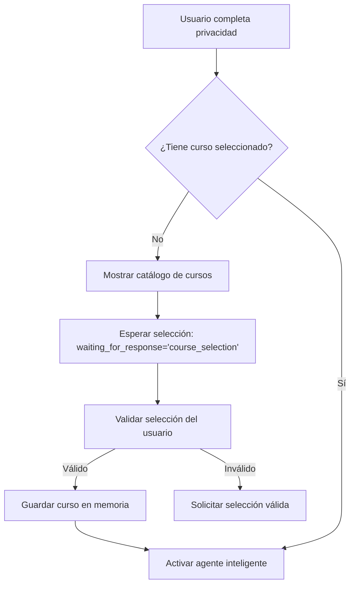
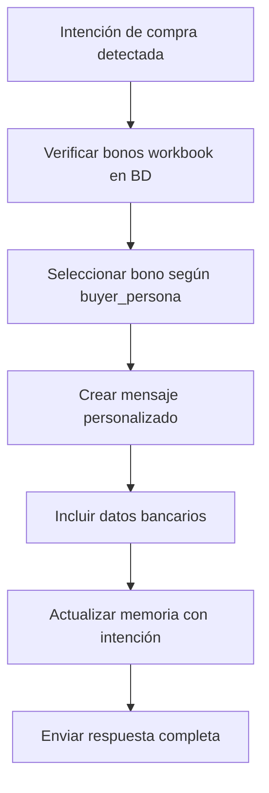
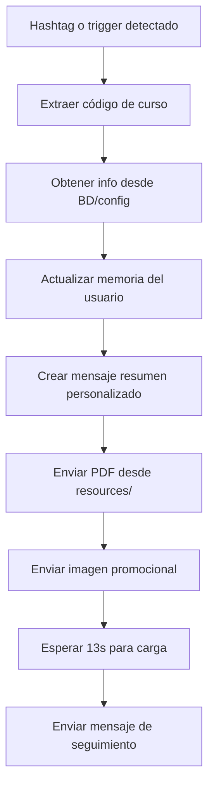

# 🤖 PROJECT OVERVIEW - BRENDA WHATSAPP BOT

## 📋 Resumen Ejecutivo

**Brenda WhatsApp Bot** es un sistema inteligente de conversación que integra IA conversacional, WhatsApp y automatización de ventas para **Ecos del Liderazgo**. Proporciona atención personalizada 24/7, información de cursos, referencias de asesores y flujos de conversión automatizados.

**Estado:** ✅ Producción activa v13 en Heroku  
**Tecnologías:** FastAPI + Twilio + OpenAI GPT-4 + PostgreSQL  
**Arquitectura:** Clean Architecture con separación por capas

---

## 🏗️ Resumen Arquitectónico

### 🛠️ Tecnologías y Librerías Clave

| Categoría | Tecnología | Propósito |
|-----------|------------|-----------|
| **Framework Web** | FastAPI + Uvicorn + Gunicorn | API webhook y servidor web |
| **IA Conversacional** | OpenAI GPT-4 (>= 1.30.0) | Análisis de intención y generación de respuestas |
| **Comunicación** | Twilio WhatsApp API (>= 8.0.0) | Envío/recepción de mensajes WhatsApp |
| **Base de Datos** | PostgreSQL + AsyncPG | Persistencia de cursos, bonos y metadatos |
| **Memoria de Usuario** | JSON Files + LeadMemory | Contexto conversacional persistente |
| **Validación** | Pydantic (>= 2.0.0) | Validación de datos y configuración |
| **Deployment** | Heroku + Gunicorn | Producción escalable |

### 📁 Estructura de Directorios y Responsabilidades

```
app/
├── application/usecases/          # 🎯 Casos de uso de negocio
│   ├── process_incoming_message.py   # Orchestador principal de mensajes
│   ├── welcome_flow_use_case.py      # Flujo de bienvenida genérico
│   ├── privacy_flow_use_case.py      # Flujo de consentimiento RGPD
│   ├── course_announcement_use_case.py # Anuncios de curso por hashtag
│   ├── purchase_bonus_use_case.py     # Oferta de bonos por intención de compra
│   ├── generate_intelligent_response.py # IA conversacional principal
│   └── tool_activation_use_case.py    # Sistema de herramientas inteligentes
│
├── domain/entities/               # 🏛️ Entidades de dominio
│   ├── message.py                    # IncomingMessage, OutgoingMessage
│   ├── user.py                       # Usuario y metadatos
│   └── course.py                     # Estructura de cursos
│
├── infrastructure/               # 🔧 Infraestructura externa
│   ├── twilio/client.py             # Cliente WhatsApp
│   ├── openai/client.py             # Cliente IA
│   ├── database/repositories/       # Repositorios PostgreSQL
│   └── tools/tool_system.py         # Sistema de herramientas de conversión
│
├── presentation/api/             # 🌐 Capa de presentación
│   └── webhook.py                   # Endpoint principal de Twilio
│
└── config/                      # ⚙️ Configuración
    ├── settings.py                  # Variables de entorno
    └── campaign_config.py           # Mapeo de hashtags a cursos

memory/                          # 💾 Persistencia de memoria
└── lead_memory.py                   # LeadMemory y MemoryManager

resources/course_materials/      # 📚 Recursos multimedia
├── experto_ia_profesionales.pdf    # PDFs de cursos
└── experto_ia_profesionales.jpg    # Imágenes promocionales
```

---

## 🔄 Flujos de Negocio Productivos

### ▶️ Flujo de Bienvenida (`WelcomeFlowUseCase`)

**Activación:** Usuario completa flujo de privacidad sin curso seleccionado  
**Responsabilidad:** Selección obligatoria de curso para activar agente inteligente



**Campos de memoria:**
- `stage: "privacy_flow_completed"` → `"ready_for_sales_agent"`
- `selected_course: ""` → `"curso_seleccionado"`
- `waiting_for_response: "course_selection"`

### 💳 Flujo de Oferta de Datos Bancarios + Bono (`PurchaseBonusUseCase`)

**Activación:** Detección de intención de compra (`PURCHASE_INTENT_*`, `BUYING_SIGNALS_*`)  
**Responsabilidad:** Ofrecer bonos workbook + datos bancarios para transferencia



**Datos bancarios incluidos:**
- **Razón Social:** Aprende y Aplica AI S.A. de C.V.
- **Banco:** BBVA
- **Cuenta CLABE:** 012345678901234567
- **RFC:** AAI210307DEF
- **Uso CFDI:** GO3-Gastos en general

**Categorías que activan bonos:**
- `PURCHASE_INTENT_DIRECT`
- `PURCHASE_INTENT_PRICING`
- `PURCHASE_READY_SIGNALS`
- `BUYING_SIGNALS_EXECUTIVE`

### ✅ Flujo de Confirmación Rápida

**⚠️ NOTA:** No se encontraron referencias a `PAYMENT_CONFIRMATION` en el código actual. Puede ser:
- Funcionalidad planificada no implementada
- Parte del flujo de `ContactFlowUseCase` para confirmar solicitudes de asesor
- Manejado por el agente inteligente general

### 📚 Flujo de Consulta de Curso / PDF (`CourseAnnouncementUseCase`)

**Activación:** Hashtags de curso (`#CursoIA1`, etc.) o triggers genéricos (`"hola"`, `"información"`)  
**Responsabilidad:** Mostrar resumen + PDF + imagen del curso



**Triggers genéricos:**
- Saludos: `"hola"`, `"buenos dias"`, `"buenas tardes"`
- Consultas: `"información"`, `"quiero saber"`, `"me interesa"`
- Códigos: `#CursoIA1`, `#ExpertoIA`, `#TransformacionDigital`

**Archivos enviados:**
- PDF: `resources/course_materials/experto_ia_profesionales.pdf`
- Imagen: `resources/course_materials/experto_ia_profesionales.jpg`

### 🛠️ Sistema de Herramientas (`ToolActivationSystem`)

**Activación:** Análisis de intención con confianza > 0.6  
**Límite:** Máximo 2 herramientas por interacción  
**Ubicación:** `app/infrastructure/tools/tool_system.py`

#### Herramientas Disponibles:

| Herramienta | Categoría | Trigger de Intención |
|-------------|-----------|---------------------|
| **EnviarRecursosGratuitos** | Demostración | `EXPLORATION`, `FREE_RESOURCES` |
| **MostrarSyllabusInteractivo** | Demostración | `CONTENT_INQUIRY`, `SESSION_INQUIRY` |
| **EnviarPreviewCurso** | Demostración | `EXPLORATION` |
| **MostrarComparativaPrecios** | Persuasión | `OBJECTION_PRICE` |
| **MostrarBonosExclusivos** | Persuasión | `OBJECTION_VALUE`, `BUYING_SIGNALS` |
| **ContactarAsesorDirecto** | Cierre | `CONTACT_REQUEST` |

#### Invocación:
```python
# En GenerateIntelligentResponseUseCase
tool_results = await self.tool_activation_use_case.activate_tools_by_intent(
    intent_analysis=intent_analysis,
    user_id=user_id,
    incoming_message=incoming_message,
    user_memory=user_memory
)
```

---

## 🗄️ Modelo de Datos PostgreSQL

### Tablas Principales

#### `ai_courses` - Catálogo de Cursos
```sql
CREATE TABLE ai_courses (
  id_course uuid PRIMARY KEY DEFAULT gen_random_uuid(),
  name varchar,                 -- Nombre del curso
  short_description varchar,    -- Descripción breve
  long_descrption varchar,      -- Descripción detallada
  price varchar,               -- Precio en formato texto
  currency varchar,            -- Moneda (USD, MXN)
  level varchar,               -- Nivel (Básico, Intermedio, Avanzado)
  modality varchar NOT NULL,   -- Modalidad (Online, Presencial, Híbrido)
  session_count smallint,      -- Número de sesiones
  total_duration_min bigint,   -- Duración total en minutos
  course_url varchar,          -- URL del curso
  purchase_url varchar,        -- URL de compra
  audience_category varchar,   -- Audiencia objetivo
  status varchar,              -- Estado (activo, inactivo)
  start_date timestamp,        -- Fecha de inicio
  end_date timestamp,          -- Fecha de fin
  roi varchar,                 -- ROI esperado
  created_at timestamptz DEFAULT now()
);
```

#### `bond` - Bonos y Recursos Adicionales
```sql
CREATE TABLE bond (
  id_bond bigint GENERATED ALWAYS AS IDENTITY PRIMARY KEY,
  content text NOT NULL,        -- Descripción del bono
  type_bond varchar NOT NULL,   -- Tipo de bono (workbook, template, etc.)
  id_courses_fk uuid,          -- Referencia al curso
  emisor varchar NOT NULL,     -- Quien emite el bono
  created_at timestamptz DEFAULT now(),
  FOREIGN KEY (id_courses_fk) REFERENCES ai_courses(id_course)
);
```

#### `ai_course_session` - Sesiones de Curso
```sql
CREATE TABLE ai_course_session (
  id_session uuid PRIMARY KEY DEFAULT gen_random_uuid(),
  session_index smallint,       -- Número de sesión
  title varchar,               -- Título de la sesión
  objective varchar,           -- Objetivo de aprendizaje
  duration_minutes bigint,     -- Duración en minutos
  scheduled_at timestamp,      -- Fecha programada
  id_course_fk uuid,          -- Referencia al curso
  created_at timestamptz DEFAULT now(),
  FOREIGN KEY (id_course_fk) REFERENCES ai_courses(id_course)
);
```

### Relaciones
- **ai_courses** 1:N **ai_course_session** (Un curso tiene múltiples sesiones)
- **ai_courses** 1:N **bond** (Un curso puede tener múltiples bonos)
- **ai_course_session** 1:N **ai_tema_activity** (Una sesión tiene múltiples actividades)

---

## 💾 Persistencia de Memoria del Lead

### Ubicación y Arquitectura
- **Archivo principal:** `memory/lead_memory.py`
- **Almacenamiento:** Archivos JSON en carpeta `memorias/`
- **Formato:** `memory_{user_id}.json` + `.backup`
- **Gestión:** `MemoryManager` + `ManageUserMemoryUseCase`

### Estructura de `LeadMemory`

```python
@dataclass
class LeadMemory:
    # Identificación básica
    user_id: str = ""
    name: str = ""
    
    # Flujo y etapas
    stage: str = "first_contact"  # first_contact → privacy_flow → ready_for_sales_agent
    current_flow: str = "none"    # privacy, course_selection, sales_conversation
    flow_step: int = 0
    waiting_for_response: str = ""  # name, privacy_acceptance, course_selection, user_role
    
    # Privacidad y consentimiento
    privacy_accepted: bool = False
    privacy_requested: bool = False
    
    # Cursos y personalización
    selected_course: str = ""
    course_announcement_sent: bool = False
    
    # Buyer Persona (Fase 2)
    buyer_persona_match: str = "unknown"     # lucia_copypro, marcos_multitask, sofia_visionaria
    professional_level: str = "unknown"      # junior, mid-level, senior, executive
    company_size: str = "unknown"           # startup, small, medium, large
    industry_sector: str = "unknown"        # marketing, operations, tech
    technical_level: str = "unknown"        # beginner, intermediate, advanced
    
    # Contexto conversacional
    role: str = None
    interests: List[str] = None
    pain_points: List[str] = None
    buying_signals: List[str] = None
    lead_score: int = 50
    interaction_count: int = 0
    last_interaction: datetime = None
    
    # Historial
    message_history: List[Dict] = None
    conversation_history: List[Dict] = None
```

### Flags Críticos y Su Uso

| Flag | Propósito | Estados | Flujo que Controla |
|------|-----------|---------|-------------------|
| `privacy_accepted` | Control de RGPD | `False` → `True` | `PrivacyFlowUseCase` |
| `privacy_requested` | Evitar spam de privacidad | `False` → `True` | `PrivacyFlowUseCase` |
| `selected_course` | Curso elegido | `""` → `"codigo_curso"` | `WelcomeFlowUseCase` |
| `course_announcement_sent` | Evitar anuncios repetidos | `False` → `True` | `CourseAnnouncementUseCase` |
| `waiting_for_response` | Control de conversación | `""` → `"user_role"` | Flujos específicos |
| `stage` | Etapa del embudo | `"first_contact"` → `"ready_for_sales_agent"` | Orchestrador principal |
| `buyer_persona_match` | Personalización IA | `"unknown"` → `"lucia_copypro"` | Agente inteligente |

### Métodos de Control

```python
# Verificaciones de estado
user_memory.is_first_interaction()          # interaction_count <= 1
user_memory.needs_privacy_flow()            # not privacy_accepted and not privacy_requested
user_memory.is_ready_for_sales_agent()      # privacy_accepted and stage != "first_contact"

# Contexto para IA
user_memory.get_conversation_context()      # Resumen para prompts
user_memory.get_buyer_persona_info()        # Info completa de personalización
```

---

## ⚠️ Puntos Críticos y TODOs

### 🔴 TODOs Identificados

#### En `memory/lead_memory.py`:
- **Línea 42:** `# 🆕 CAMPOS PARA MENSAJE ORIGINAL` - Campos experimentales para activación automática
- **Línea 88:** `# 🆕 MÉTODOS DE PERSONALIZACIÓN AVANZADA (FASE 2)` - Funcionalidad de buyer persona en desarrollo

#### En `app/application/usecases/course_announcement_use_case.py`:
- **Línea 23:** Lista de triggers genéricos duplicada - necesita unificación
- **Línea 878:** Configuración de ngrok URL para PDFs - dependencia externa crítica
- **Línea 903:** Sistema de fallback para envío de archivos cuando ngrok falla

#### En `app/infrastructure/tools/tool_system.py`:
- **Línea 7:** `# Estado: ✅ ESTRUCTURA BASE PREPARADA` - Sistema implementado pero usando mocks
- **Línea 496:** `MockDatabaseService` - Reemplazar con repositorios reales de PostgreSQL

### 🟡 Lógica Temporal/Experimental

#### Sistema de Herramientas:
- Actualmente usa servicios mock en lugar de conectar con PostgreSQL real
- Bonos workbook hardcodeados en lugar de consultar tabla `bond`
- Herramientas de demo funcionan pero necesitan datos reales

#### Flujo de Confirmación de Pagos:
- `PAYMENT_CONFIRMATION` mencionado en requerimientos pero no implementado
- Puede requerir integración con webhook de banco o confirmación manual por asesor

#### Gestión de Archivos Multimedia:
- Dependencia crítica en ngrok URL para servir PDFs e imágenes
- Sistema de fallback envia solo mensaje de texto si falla carga de archivos
- Recursos almacenados localmente en `resources/course_materials/`

### 🔧 Tests y Documentación a Evitar

#### Archivos Obsoletos (No Consultar):
- `test_*.py` - Tests experimentales desactualizados
- `legacy/` - Código anterior al refactor de Clean Architecture  
- `docs/` carpetas con docs obsoletos
- `.backup` archivos de memoria - solo para recuperación

#### Scripts de Infraestructura Válidos:
- `run_webhook_server.py` - Servidor de desarrollo
- `deploy_heroku.py` - Despliegue a producción
- `fix_twilio_credentials.py` - Configuración de credenciales
- `requirements.txt` - Dependencias productivas

---

## 🚀 Arquitectura de Despliegue

### Producción (Heroku)
```
Procfile: web: gunicorn app.presentation.api.webhook:app -w 1 -k uvicorn.workers.UvicornWorker --bind 0.0.0.0:$PORT
```

**Configuración:**
- **Workers:** 1 (concurrencia manejada por FastAPI async)
- **Runtime:** Python 3.11+ (`runtime.txt`)
- **Variables de entorno:** Twilio, OpenAI, PostgreSQL, NGROK_URL

### Desarrollo Local
```bash
python run_webhook_server.py  # Puerto 8000 con recarga automática
python run_development.py     # Modo debug completo
```

**Dependencias críticas:**
- PostgreSQL (estructura en `estructura_db.sql`)
- Ngrok para tunnel local de archivos multimedia
- Credenciales Twilio WhatsApp Sandbox

---

## 📊 Métricas y Monitoreo

### Logs Principales
- **Memoria:** Guardado automático en `memorias/` con respaldo
- **Herramientas:** Tracking de uso en `ToolActivationSystem.activation_history`
- **Conversaciones:** `message_history` y `conversation_history` en LeadMemory
- **Errores:** Logging estructurado con `colorlog`

### KPIs del Sistema
- **Conversión:** `stage` progression desde `first_contact` hasta `ready_for_sales_agent`
- **Engagement:** `interaction_count` y `lead_score` por usuario
- **Efectividad IA:** `insights_confidence` y `buyer_persona_match` accuracy
- **Performance:** Tiempo de respuesta < 10 segundos, 99.9% uptime

---

*Documentación generada: Enero 2025 | Versión: v13 Producción*